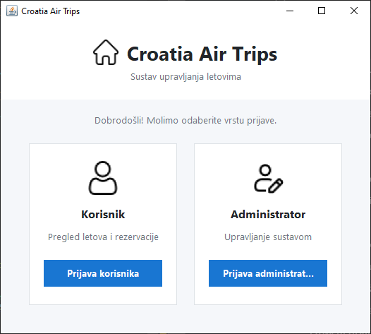
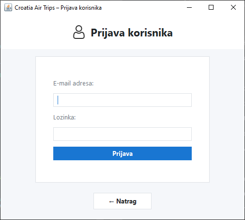
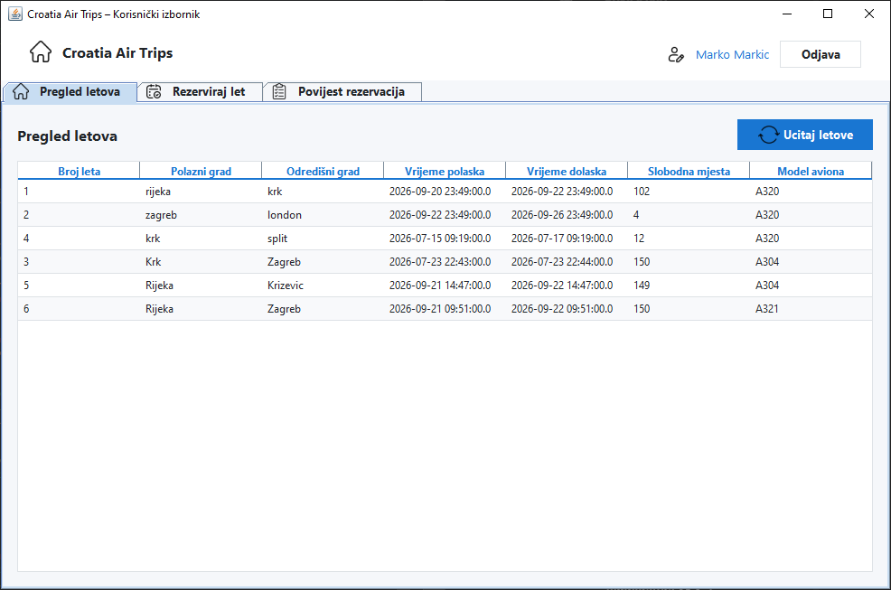
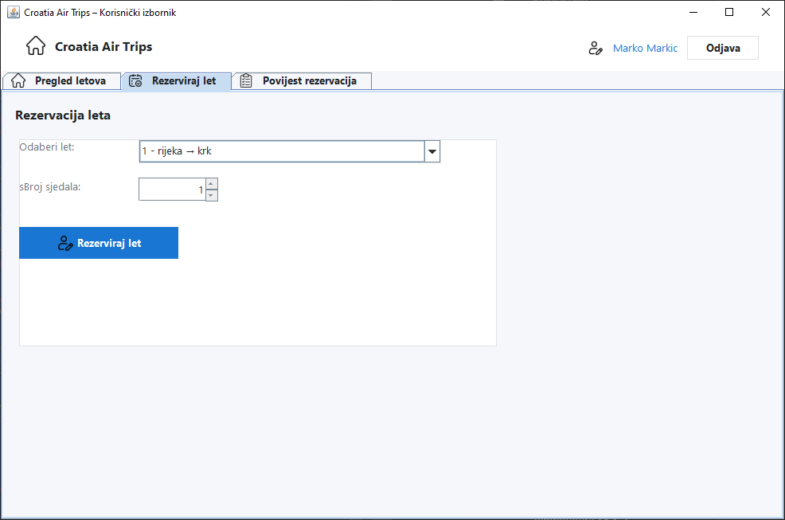
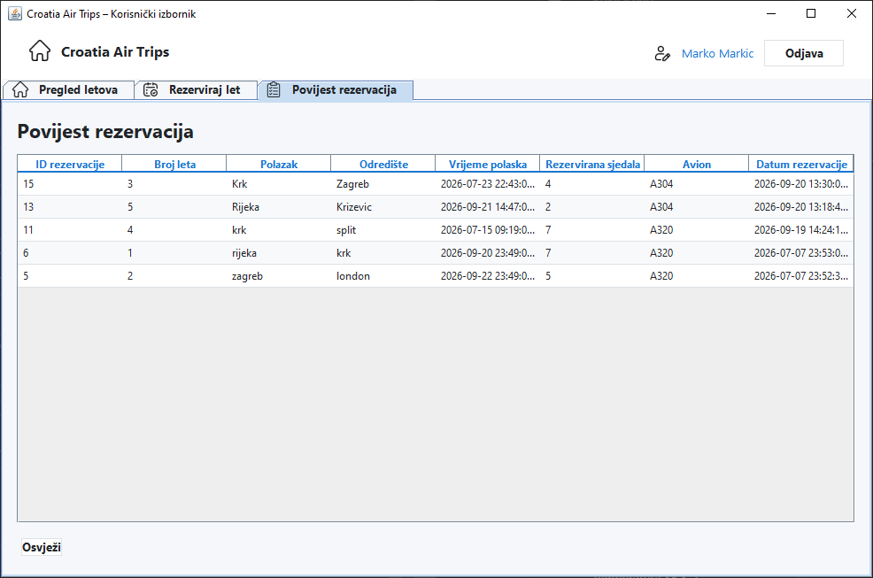
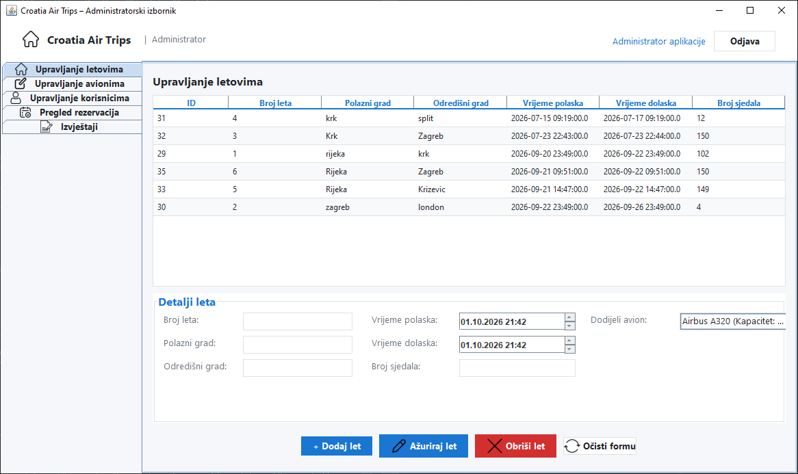
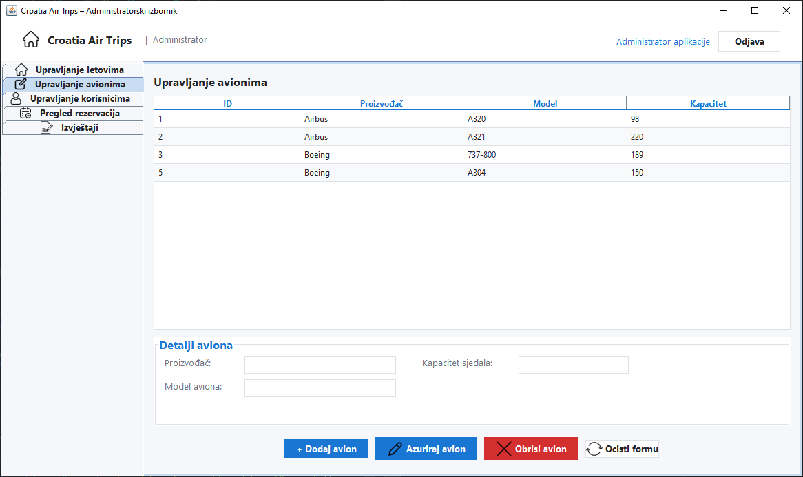
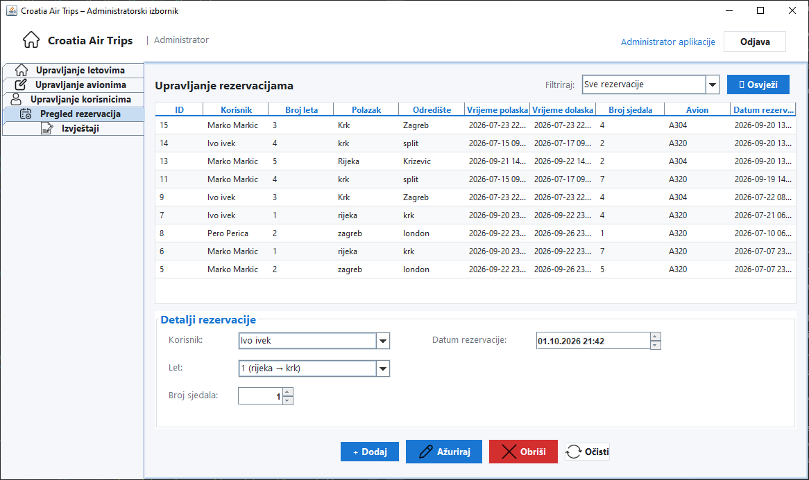
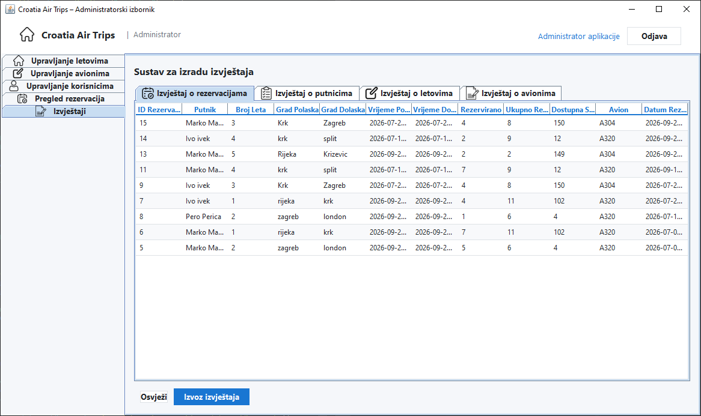

# Croatia Air Trips

Java Swing desktop application for managing panoramic flights and reservations, developed as a final-year thesis.

## Features

- Separate user and administrator interfaces
- Flight browsing and seat reservations
- User reservation history
- Administration of flights, aircraft, users and reservations
- Reports exported to CSV, TXT and Excel (XLSX)
- MySQL database access through JDBC and SQL queries

## Screenshots

The application interface is in Croatian.

User interface

### User login

### Flight browsing

### Flight reservation

### Reservation history

Administrator interface

### Flight management

### Aircraft management

### Reservation management

### Reports

## Technologies

Java, Swing, JDBC, MySQL, Apache POI and Eclipse.

## Running the project

1. Install a JDK and Eclipse IDE for Java Developers. Compilation was checked with JDK 24.
2. Download or clone this repository.
3. In Eclipse, select **File > Import > General > Existing Projects into Workspace** and select the project folder.
4. Prepare a MySQL database with the application's schema (see the database note below).
5. In **Run > Run Configurations > Java Application**, choose `panorama.GlavnaStr` as the main class.
6. Under **Environment**, add your own connection settings:

| Variable | Example |
| --- | --- |
| `DB_URL` | `jdbc:mysql://localhost:3306/panoramski_letovi` |
| `DB_USER` | `your_database_user` |
| `DB_PASSWORD` | `your_database_password` |

7. Use the project root as the working directory so that icons can be loaded, then run the application.

Database credentials are read from environment variables and are not included in the source code.

## Database availability

The supplied project archive did not contain a database schema or sample-data SQL script. This repository currently contains the application source and dependencies; running database-dependent features requires a compatible MySQL database. A sanitized schema and fictional sample data still need to be added for a self-contained demo.

## Known limitations

- Excel export currently writes date values without a display format, so Excel may show serial numbers until the cells are formatted as dates.

## Validation

- All 27 Java source files compiled during preparation.
- The included Excel libraries passed a workbook creation and reopening check.
- Database operations and end-to-end user workflows were not tested during this preparation.

## Project context

Academic final-year project by Marko Kos. This repository demonstrates desktop application development, database integration and reporting.
